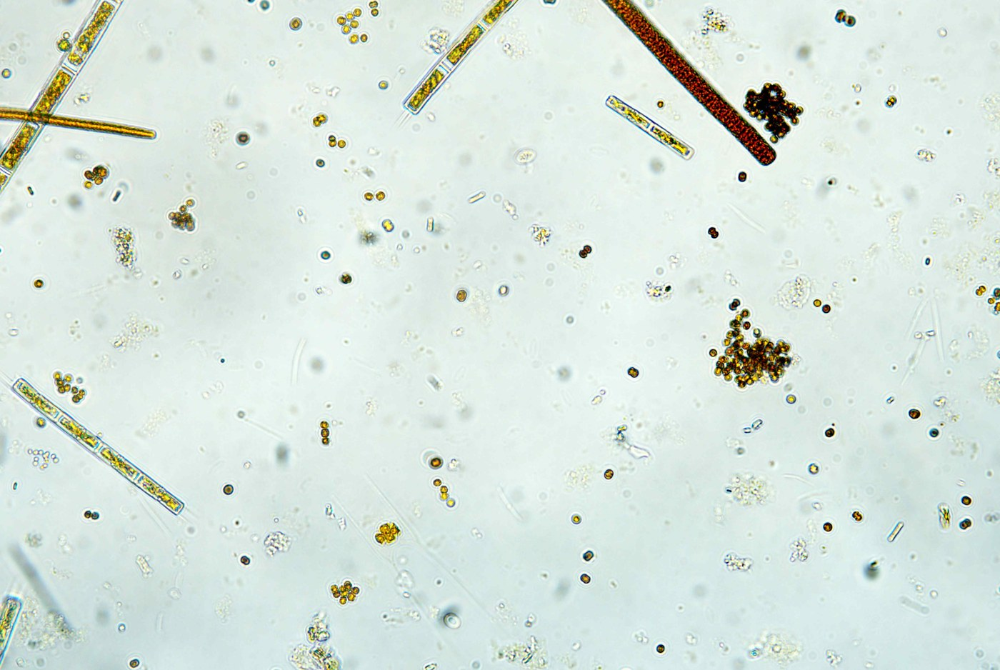

# Algae Microscopic Multi-Focus Image Fusion

这是一个本科毕业设计期间完成的个人项目，用于实现浮游藻类显微多焦距图像融合。项目面向高倍显微成像景深较浅的问题，将同一显微视野下 5 张不同焦平面的源图像融合为一张更便于观察的全聚焦图像。

本仓库主要用于展示项目代码、训练流程、推理流程和相关实验工具。项目早期参考过 m-SegNet 等显微图像融合工作的思路，但当前仓库以自己的实现和实验代码为主，不作为某篇论文的复现仓库。数据集、训练日志、模型权重和实验输出默认不纳入 Git 仓库。

## Features

- 固定 5 张源图像输入，输出单张融合图像
- 面向浮游藻类显微图像场景，处理透明目标、弱边界、小目标密集等情况
- 包含训练、推理、评估、可视化和对比实验脚本
- 使用轻量化决策网络完成像素级源图选择
- 支持伪标签训练、无参考清晰度指标评估和高分辨率瓦片推理
- 推理阶段包含超像素投票、边缘过渡和滤波等后处理流程

## Method Overview

项目的核心思路是把多焦距融合看作“五选一”的源图选择问题。对于每个像素位置，模型预测该位置应当来自 5 张源图中的哪一张，再根据决策结果合成融合图像。

主要流程：

1. 读取同一显微视野下的 5 张不同焦平面图像。
2. 提取梯度、Laplacian 响应等与清晰度相关的特征。
3. 使用轻量化决策网络预测每个像素对应的源图选择结果。
4. 训练阶段结合伪标签、Focal Loss 和梯度约束进行优化。
5. 推理阶段可对高分辨率图像进行瓦片处理，并通过后处理改善空间连续性。

## Project Structure

```text
multi-focus/
├── comparison/          # 对比实验与基线方法脚本
├── config/              # 配置文件
├── demo/                # 演示脚本
├── inference/           # 推理、导出和性能测试脚本
├── models/              # 模型结构、模块和损失函数
├── tools/               # 辅助工具和第三方方法参考代码
├── utils/               # 数据加载、图像增强、指标和可视化工具
├── verification/        # 验证与实验分析脚本
├── evaluate.py          # 模型评估入口
├── pseudo_label.py      # 伪标签生成脚本
├── train.py             # 模型训练入口
└── requirements.txt     # Python 依赖
```

## Installation

建议使用虚拟环境安装依赖。

```bash
git clone https://github.com/your-name/multi-focus.git
cd multi-focus
python -m venv .venv
```

Windows:

```bash
.venv\Scripts\activate
pip install -r requirements.txt
```

Linux/macOS:

```bash
source .venv/bin/activate
pip install -r requirements.txt
```

## Dataset

数据集不随仓库发布。请将数据准备为分组格式，每个 `group_xxx` 目录下放置同一显微视野的 5 张不同焦平面图像。

```text
all_data/
└── split_data/
    ├── train/
    │   └── group_001/
    │       ├── img_1.png
    │       ├── img_2.png
    │       ├── img_3.png
    │       ├── img_4.png
    │       └── img_5.png
    ├── val/
    └── test/
```

本项目当前训练和评估流程不使用 `gt.png` 作为监督或参考图像。每个图像组应只包含 5 张参与融合的源图像。

更多数据准备说明见 [DATASET.md](DATASET.md)。

## Training

示例训练命令：

```bash
python train.py ^
  --data ./all_data/split_data/train ^
  --val_data ./all_data/split_data/val ^
  --epochs 60 ^
  --batch 8 ^
  --model-version v5 ^
  --output ./runs/train
```

Linux/macOS 可将 `^` 替换为 `\`。如果显存有限，可以适当减小 `--batch`。

常用参数：

```text
--data                 训练数据目录
--val_data             验证数据目录
--epochs               训练轮数
--batch                batch size
--lr                   学习率
--device               设备编号，例如 0 或 cuda
--model-version        模型版本，可选 v2/v3/v4/v5/v6
--output               训练输出目录
```

训练输出默认保存在 `runs/train/`，该目录已被 `.gitignore` 忽略。

## Inference

使用训练好的权重进行五源图像融合：

```bash
python inference/infer.py ^
  image1.png image2.png image3.png image4.png image5.png ^
  -m ./runs/train/your_experiment/checkpoints/best.pt ^
  -o fused.png
```

对于显微镜原始高分辨率图像，可使用瓦片推理策略降低显存压力。

## Evaluation

```bash
python evaluate.py ^
  --model ./runs/train/your_experiment/checkpoints/best.pt ^
  --data ./all_data/split_data/test ^
  --output results.json
```

项目中使用的评估指标主要包括：

- `SF`: Spatial Frequency，反映图像整体清晰度
- `AG`: Average Gradient，反映边缘锐利程度
- `MI`: Mutual Information，反映信息保留情况
- `QABF`: 基于边缘信息保留的融合质量指标
- `Score`: 简单综合评分，定义为 `Score = SF + 0.5 × AG`

这些指标用于项目内部实验分析，不代表对不同方法的严格公开排名。

## Results and Demo

仓库在 `assets/` 中放置了少量示例图片，用于展示输入源图和融合效果。

```markdown

```

建议只放置轻量级示例图，完整实验输出、训练日志和大体积结果文件不要直接提交到 GitHub。

## Model Weights

模型权重文件通常较大，不建议直接提交到 GitHub 仓库。

推荐做法：

- 使用 GitHub Releases 发布 `.pt` 或 `.pth` 权重
- 使用 Hugging Face、Google Drive、百度网盘等外部存储
- 在 README 中提供下载链接和对应模型版本说明

下载后的权重可放置在：

```text
checkpoints/
```

## Third-Party Code

`tools/` 目录中可能包含第三方方法、辅助工具或参考实现。公开发布前请确认对应代码、模型权重和数据集的许可证允许再分发，并在必要时保留原始声明。

如果第三方代码仅用于本地实验，也可以在上传前将其移出仓库，或只保留调用说明。

## License

This project is released under the MIT License. See [LICENSE](LICENSE) for details.


